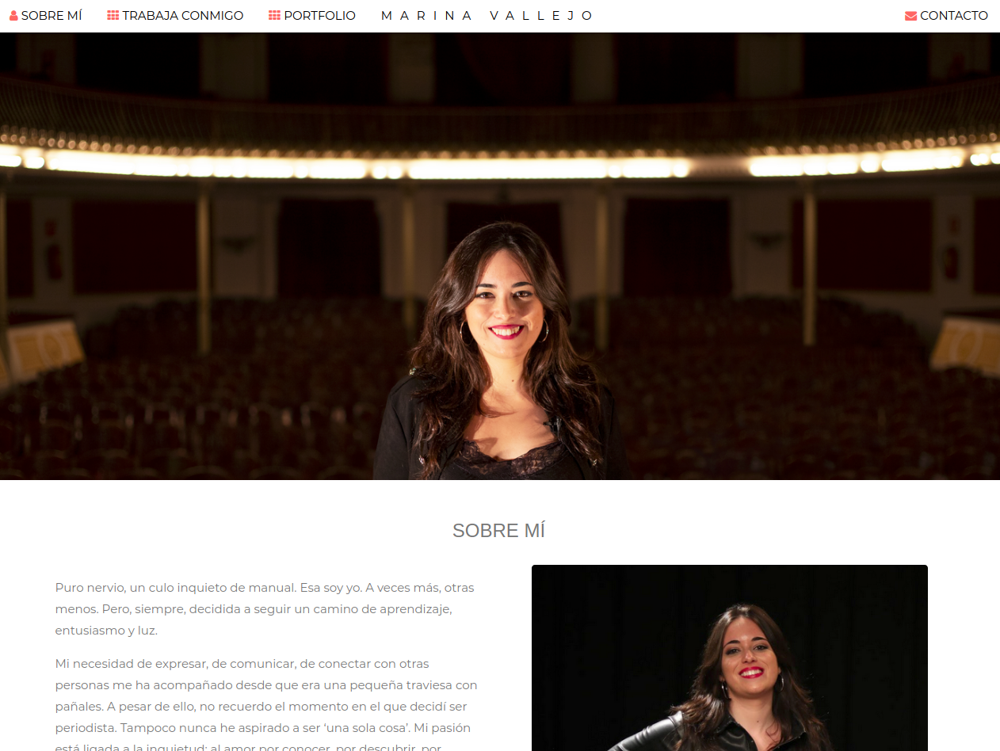
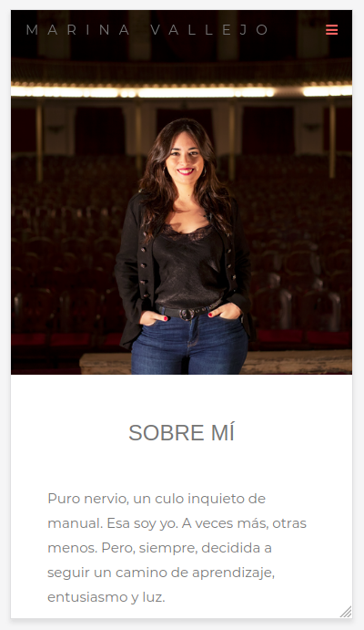

# Professional Freelancer Website - Parallax Style
## Summary
This project is a professional website for a Freelancer, using plain HTML, CSS and Javascript.

Live project on 

## Functionalities
It's a simple professional website that uses parallax effect and it's optimized for mobile and smaller screens using a static view.
### Computer View (Big screens)

### Mobile View (Smaller screens optimization)

## TODO List
- [x] Website design and implementation
- [x] Add responsiveness
- [x] Mobile optimization